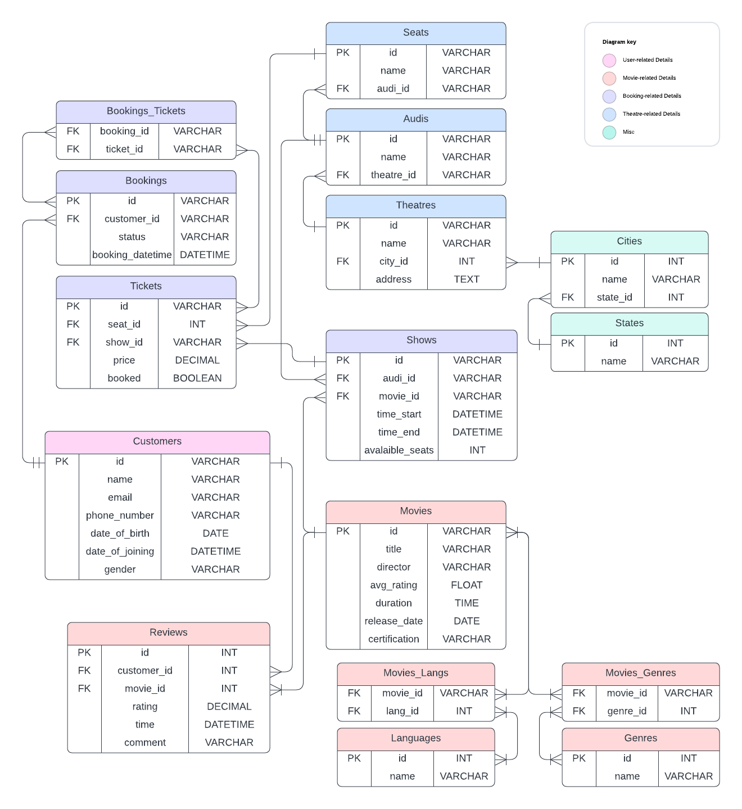
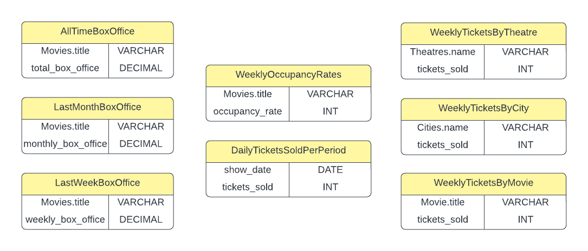

# Design Document

By Amog Rao, Mudit Surana, and Nimrat Kaur

## Scope
The primary purpose of this database is to facilitate a movie ticket booking system. Here's what it aims to achieve:
 * Manage movie listings: Store information about movies (title, release date, genre, ratings, etc.).
 * Track showtimes and venues: Record show timings, theatres, auditoriums, and available seating.
 * Handle customer bookings: Manage customer information, ticket reservations, and booking confirmations.
 * Support basic reporting: Provide insights into sales trends, movie popularity, and occupancy rates.
In Scope:
 * People:
   * Customers (name, email, contact information, booking history)
 * Places:
   * States
   * Cities
   * Theatres
   * Auditoriums (within Theatres)
 * Things:
   * Movies
   * Movie Genres
   * Movie Languages
   * Shows (screenings of a specific movie, at a specific time, in a specific auditorium)
   * Seats (individual seats within an auditorium)
   * Tickets
   * Bookings (linking customers to tickets with a status)
   * Reviews (customer ratings for movies)
Outside the scope:
   * Financials: No detailed accounting, payment gateway integration, or complex discount/promotional pricing mechanisms.
   * Detailed Inventory: No tracking of concessions (food/beverages) or other merchandise sales.
   * User Authentication: While the Customers table stores basic information, it likely doesn't manage passwords or complex user permissions.
   * External Systems: The database doesn't seem to handle interactions with third-party services (e.g., map providers for theatre locations).

## Functional Requirements
There are 8 major functional requirements that this database satisfies:
1. **Locations**: Multiple theatres are located at different citites, and these cities are located in states. Making a "States" table and a "Cities" table
    * reduces redundancy that occurs when these states and cities have to be repeated multiple times
    * makes it easier to query for theatres belonging to a state or a city (helpful in regional box office stats)

2. **Users**: Users refers to the customers in this case. A user can purchase tickets several times, and it's important to link these tickets to the user. A user's table
    * helps in mainting a track of all the customers
    * can be useful to understand user demographics (distribution in age groups, gender ratio, linguistic interests, etc.) that will be beneficial for an app to come up with better schemes to attract more users or increase retention rates
    - assists in linking tickets to a user and accessing a booking history assigned to that user through queries

3. **Languages & Genres**: Movies are made in particular langauages with a few genres in mind! A Languages table and a Genres table
    * is useful to keep associate movies to genres and languages
    * makes queries much simpler to access movies from a particular genre or language (which is very important necessity when user's prefer watching the movie in a particular langue and enjoy certain genres)

4. **Theatres, Audis, and Seats**: A Multiplex Theatre may have multiple Auditoriums, and each Auditorium has multiple seats! Therefore, each seat is associated to an auditorium, and each auditorium is associated to the seat. Users book a seat in an auditorium that is in a theatre. Having the theatre table, auditorium table, and seats table
    * enables queries that can get fetch auditoriums in shows and their respective seats
    * helps in keeping tack of audis in theatres, and seats in those audis
    While booking seats, it's essential to be able to query auditoriums within that theatre, and seats within that auditorium.

5. **Shows**: All tickets are booked for a specific show. Users essentialy book tickets for a show (which is defined by the movie, location, and timing). Having a show table
    * collates necessary details such as start time, movie, auditorium, etc. 
  
6. **Tickets & Bookings**: Each user essentially books a set of tickets. A booking refers to an attempt to book a set of tickets. This is the primary purpose of the database - to let users book tickets and cancel them if they want to. The Tickets and Bookings table
    * organize a list of tickets that can be bought by users
    * maintain a series of bookings that have been taken place
    * enables queries to find tickets pertaining to a show (and queries to know how many tickets are sold which in turn helps in determining the occupancy rates - another crucial metric in the film industry)
    * enables queries to find bookings of a user

    In fact, a booking can be cancelled, and the ticekts have to be displayed as available again, but this booking history of confirmations and cancellations must be stored, and this database strongly satisfies this requirement thereby retaining more data for further analysis on user booking patterns.

7. **Reviews**: Users should be able to write reviews on their movies along with providing ratings for the movie. Further the Reviews table
   * helps in acquring queries to find the average ratings of movies
   * boosts user engagement (which is fundamental in such apps)

8. **Box Office Statistics**: This functionality is also satisfied as the total box office, along with weekly, regional, linguistic, box offices can be calculated. Occuopancy rates are also calculated similarly in this database schema. These are very important metrics in the film industry.

So in a nutshell, the user has the ability to register an account, select movie shows of prefernce, choose a seat, and book a set of tickets. Additionally these bookings may also be cancelled. The user also has the ability to obtain movies of particular genres or languages. Furthermore, the user can write reviews and provide ratings for movies, and can take a look at the box office of several movies.

Booking beverages, setting a configuration of seats within the auditorium, maintaining seperate tables for employees, curating a list of cast & crew for several films in a dedicated table, are all **out of scope for this project**.

## Representation
There are 16 tables, 8 views, 4 triggers and 5 indices. This is for optimizing the 8 Major Functionalities of our database.
### Entities
Our database had the following entities as listed below. The attributes for each of these entities are mentioned with their types. The explanations for our table and column constraints are given as well.
 1. States: 
     1. id PRIMARY KEY INT NOT NULL AUTOINCRMENT
     2. name VARCHAR(50) UNIQUE NOT NULL
    **Constraints**: id requires the NOT NULL constraint due to a loophole as per the sqlite documentation wherein a primary key can take on a null value. Name of the state needs to be unique and cannot be left empty.
2. Cities:
    1. id PRIMARY KEY INT NOT NULL AUTOINCRMENT
    2. name VARCHAR(75) NOT NULL
    3. state_id INTEGER NOT NULL
    **Constraints**: Each city needs to be associated to a state. In the case of a Union Territory, it will be included both as city and state. Hence, stat_id cannot be null.
3. Theatres:
    1. id VARCHAR(20) PRIMARY KEY NOT NULL
    2. name VARCHAR(255) NOT NULL
    3. city_id INTEGER NOT NULL
    4. address TEXT NOT NULL
    **Constraints**: Each theatre has to be associated to a city. Here, city is a broader term that includes towns and villages as well if need be. Every theatre must specify an address for the user's convenience. The primary key id is a VARCHAR to optimize the amount space it would take since the number of theatres is large.
4. Audis:
    1. id VARCHAR(30) PRIMARY KEY NOT NULL
    2. name VARCHAR(30) NOT NULL
    3. theatre_id VARCHAR(20) NOT NULL
    **Constraints**: Each audi has to be associated to a theatre. In case a single plex, the theatre name is stored both as an audi and a theatre. The primary key is of a bigger size as the number audis is more than the number of theatres.
5. Seats: 
    1. id VARCHAR(40) PRIMARY KEY NOT NULL
    2. name VARCHAR(5) NOT NULL
    3. theatre_id VARCHAR(30) NOT NULL
    **Constraints**: Each seat has to be associated to an audi and hence, audi_id cannot be null. The primary key is of a bigger size as the number seats is more than the number of audis.
6. Movies: 
    1. id VARCHAR(20) PRIMARY KEY NOT NULL
    2. title VARCHAR(255) NOT NULL
    3. director VARCHAR(255)
    4. avg_rating DECIMAL(4, 2)
    5. release_date DATE NOT NULL
    6. duration TIME NOT NULL
    7. certification VARCHAR(3) NOT NULL CHECK (certification IN ('U', 'U/A', 'A', 'S'))
    **Constraints**: avg_rating has a constraint of being in the range of 0 to 10 (inclusive). Certification is only given if limited types and hence, it has a check condition as well.
7. Languages:
    1. id INTEGER PRIMARY KEY AUTOINCREMENT
    2. name VARCHAR(50) UNIQUE NOT NULL
    **Constraints**: The language name has a unique constraint.
8. Genres: 
    1. id INTEGER PRIMARY KEY AUTOINCREMENT NOT NULL
    2. name VARCHAR(50) UNIQUE NOT NULL
    **Constraints**: The genre name has a unique constraint.
9. Movies_Langs: 
    1. movie_id VARCHAR(20) NOT NULL
    2. lang_id INTEGER NOT NULL
    **Constraints**: Both movie_id and lang_id are passed as a primary key for denoting the many-to-many relationship.
10. Movies_Genres:
    1. movie_id VARCHAR(20) NOT NULL
    2. genre_id INTEGER NOT NULL
    **Constraints**: Both movie_id and genre_id are passed as a primary key for denoting the many-to-many relationship.
11. Reviews:
    1. id VARCHAR(40) PRIMARY KEY NOT NULL
    2. customer_id VARCHAR(30)
    3. movie_id VARCHAR(20) NOT NULL
    4. rating DECIMAL(4, 2) NOT NULL,
    5. time DATETIME NOT NULL DEFAULT CURRENT_TIMESTAMP,  
    6. comment TEXT,
    **Constraints**: The rating is constrained to be in a range between 0 to 10 (inclusive). It cna be noted that customer_id may be null to allow anonymous reviews.
12. Customers:
    1. id VARCHAR(30) PRIMARY KEY NOT NULL
    2. name VARCHAR(255) NOT NULL
    3. email VARCHAR(255) UNIQUE NOT NULL
    4. phone_number VARCHAR(14) UNIQUE NOT NULL
    5. date_of_birth DATE NOT NULL
    6. date_of_joining DATETIME NOT NULL DEFAULT CURRENT_TIMESTAMP
    7. gender CHAR(1) NOT NULL
    **Constraints**: email has a constraint of containing the character '@' to ensure that an email has been passed. It is also uniqye like the phone_number. phone_number has constraint of starting with '+' to enter the country code and only allows numeric characters. date_of_joining is by deafult set to the current time.
13. Shows: 
    1. id VARCHAR(40) PRIMARY KEY NOT NULL
    2. movie_id VARCHAR(20) NOT NULL
    3. audi_id VARCHAR(30) NOT NULL
    4. time_start DATETIME NOT NULL
    5. time_end DATETIME NOT NULL
    6. available_seats INTEGER NOT NULL DEFAULT 0
    **Constraints**: time_end has to be greater than time_start and the available seats can only be a non-negative integer
    14. Tickets: 
    1. id VARCHAR(40) PRIMARY KEY NOT NULL
    2. show_id VARCHAR(40) NOT NULL
    3. seat_id INTEGER NOT NULL
    4. booked BOOLEAN DEFAULT FALSE NOT NULL
    5. price DECIMAL(10, 2) NOT NULL CHECK(price >= 0)
    **Constraints**: The price can only take in a non-negative numeric value.
15. Bookings:
    1. id VARCHAR(40) PRIMARY KEY
    2. customer_id VARCHAR(30) NOT NULL,
    3. status VARCHAR(20) NOT NULL CHECK (status IN ('booked', 'cancelled', 'held', 'dropped))
    4. booking_datetime DATETIME NOT NULL DEFAULT CURRENT_TIMESTAMP
    **Constraints**: The status of a booking can only be from a certain set and hence, it has a check condition.
16. Bookings_Tickets: 
    1. booking_id VARCHAR(40) NOT NULL
    2. ticket_id VARCHAR(40) NOT NULL
    **Constraints**: Both booking_id and ticket_id are passed as a primary key for denoting the many-to-many relationship.

### Relationships

* **Cities and States (many-to-one)**: Many cities can belong to the same state.
* **Theatres and Cities (many-to-one)**: Many theatres can belong to the same city.
* **Audis and Theatres (many-to-one)**: Many audis can belong to the same theatre.
* **Seats and Audis (many-to-one)**: Many seats can belong to the same audi.
* **Shows and Audis (many-to-one)**: Many shows can be in the same audi.
* **Tickets and Shows (many-to-one)**: Many tickets can be generated for the same show.
* **Tickets and Seats (many-to-one)**: Many tickets can be generated for the same seat.
* **Shows and Movies (many-to-one)**: Many shows can be showing the same movie.
* **Reviews and Customers (many-to-one)**: Many reviews can be written by the same customer.
* **Reviews and Movies (many-to-one)**: Many reviews can written for the same movie.
* **Bookings and Customers (many-to-one)**: Many bookings can be made by the same customer.
* **Bookings and Tickets (many-to-many)**: Many bookings can be made for the same ticket as a booking can be cancelled as well. One booking can be made for multiple tickets at once.
* **Movies and Genres (many-to-many)**: Many movies can belong to the same genre. One movie can have multiple genres.
* **Movies and Languages (many-to-many)**: Many movies can be made in the same language. One movie can be made in multiple languages.

## Optimizations
### Indexes
* Covering index on show_id and available_seats in Shows.
* Covering index on seat_id and audi_id in Seats.
* Covering index on ticket_id and booked in Tickets.
* Covering index on ticket_id and price in Tickets.
These triggers are only on Shows and Tickets. Entries to these tables are made only once week and hence, slowing down of the insertion or updation process is not of concern. These triggers would boost the speed for the user.

### Views

* WeeklyOccupancyRates:
    Purpose: Calculates the percentage of seats occupied for each movie over the past week.
    Optimization: Provides a pre-calculated metric for analyzing the popularity of movies and identifying shows with high or low demand.

* AllTimeBoxOffice, LastMonthBoxOffice, LastWeekBoxOffice:
    Purpose: Calculates total box office revenue (money generated from ticket sales) for each movie, grouped by different time periods (all-time, last month, last week).
    Optimization: Aggregates sales data, making it easier to track revenue trends, identify top-performing movies, and potentially make decisions about future movie programming.

* DailyTicketsSoldPerPeriod:
    Purpose: Breaks down ticket sales into time periods (e.g., 6AM-9AM, 9AM-12PM).
    Optimization: Helps analyze peak sales times, potentially leading to staffing or show-time adjustments for optimal resource allocation.

* WeeklyTicketsByTheatre, WeeklyTicketsByCity, WeeklyTicketsByMovie:
    Purpose: Calculates the number of tickets sold for the past week, grouped by theatre, city, and movie, respectively.
    Optimization: Provides insights into location-based popularity, which shows perform well in specific areas, and potential theatre performance comparisons.

    Pre-Calculated Data: Views store the results of potentially complex aggregations and joins.  This avoids recalculating these metrics every time you need them in a report.
    Simplified Queries: Views can hide the complexity of the underlying SQL, making it easier for users to query for the summarized data they need.
    Readability: Views give meaningful names to calculated metrics, making it clear what the data represents.

## Limitations
* It is entirely user-centric and does not keep track of the owners of the theatres.
* Since it doesn't keep track of cast and crew, the database cannot be used get recommendations based on these.
* It does not account for different formats of theatres such as outdoor movie viewings which don't have allocated seats.
* Our database is limited only to movie shows unlike BookMyShow which also caters to concerts, fests and more.
* The configuration of seats cannot be reperesented.
* It does not facilitate purchase of food and beverages.

